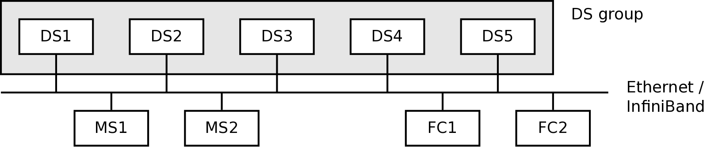

# CPFS installation

Thank you for using the open-source version of CPFS, the ClusterTech
Parallel File System.  CPFS provides you with a high-performance
distributed parallel filesystem which is fault tolerant while being
very easy to set up.  The interface is highly POSIX compliant, so most
applications do not need to be rewritten to enjoy the high speed and
fault tolerance provided by CPFS.  In this document, we guide you
through the set up procedures.  But you need some basic concepts first.

There are three components in a CPFS cluster:

*DS (The data server)*
: A data server is a daemon process which stores the actual filesystem
data in a local directory.  DSs organize themselves into one or more
DS group(s) of 5 (a compile-time constant, see `kNumDSPerGroup` in
`cpfs/common.hpp` if you want to change it).  In case one DS of a
group is lost, the group will continue to operate in degraded mode,
akin to how a RAID-5 disk array continues to work after losing one
disk.  If a previously failed DS is restarted, it resynchronizes
modified files since the failure with other DSs automatically.  If a
new DS is used instead, all files will be resynchronized.  During the
resynchronization process, filesystem requests will queue waiting for
its completion and will not be responsive.

There are two implications.  Firstly, the system will experience only
a short period of time that the server is not responsive when a server
is lost.  But when a data server is restarted, the amount of
unresponsive time depends on the amount of data to resynchronize: the
larger the amount of data to resynchronize, the longer the
interruption.

Secondly, the amount of data to resynchronize depends on the total
size of files to resynchronize.  If files are relatively small, and
only a few files are modified, the interruption is very short.  In
contrast, if many files are modified, and they are large, the
interruption can be very long.

*MS (The metadata server)*
: A metadata server is a daemon process which stores metadata in a
local directory.  Up to two MS may be set up to provide fault
tolerance.  At any time, one MS is active while the other (if
configured) runs as a standby.  If the standby server finds that the
active server is lost and the DSs connect to it, it will take over and
become the active server automatically.  Similar to DS,
resynchronization of a restarted MS is automatic, and leads to
interruption of service in form of unresponsive server.

*FC (The filesystem client, mount points)*
: A filesystem client is a FUSE based daemon process which talks to
the CPFS servers when a mount point is accessed by other local
programs, in order to provide a POSIX filesystem interface at the
mount point.

An example of a simple CPFS network is as follows.

# Planning the cluster #

## Hardware ##

CPFS works with various kinds of block storage devices and x86
machines.  For best performance and fault tolerance, it is recommended
to run MSs, DSs and FCs on separated machines, and run MSs and DSs on
machines with at least 4 CPU cores and 4 GB of memory.  It is possible
for the same host to serve both as a MS and a DS, although this is not
highly recommended.

## Operating System ##

CPFS can run on top of a recent 64-bit CentOS / RHEL, Fedora, Ubuntu
or Debian Linux distribution.  Build scripts are prepared so that it
is easy to create suitable binary for each of these distributions
using Docker.  These build scripts are very simple, and can be adapted
to other distributions relatively easily.

## Storage ##

To ease disk space management, we recommend dedicating a hard disk
partition for the local directory of each MS and DS.  It is best to
use XFS for these partitions and format with option `-n ftype=1`
(if supported by your `mkfs.xfs`), although ext4 or other
filesystems supporting extended user attributes may also be used.  Due
to RAID-5 like redundancy in DSs, the storage capacity provided by a
DS group is around 4 times the least capacity of the DSs among the
group.  Each file in the filesystem is represented by around 3 files
in each MS.  So it is important that the MSs has ample amount of
inodes available for use.  Most of these files are single block files,
so very little space is used by files in the MS, other than the inode
usage.  When formatting the local directory for use by the MS, these
should be taken into account.

To make the servers write data to storage earlier, we recommend using
a small value, say 67108864 (i.e., 64 MB), for the kernel sysctl
`dirty_background_bytes` setting.  This can be done, for example, by
adding a line to `/etc/rc.d/rc.local`:

    echo 67108864 > /proc/sys/vm/dirty_background_bytes

This replaces the use of the `dirty_background_ratio` setting.  You
should also observe other suggestions found in `/etc/rc.d/rc.local`,
which differs from version to version.

## Networking ##

For high performance we recommend using a high-performance backend
network for the CPFS servers, typically an InfiniBand (IB) or 10G
Ethernet network.  The system itself makes no assumption about network
speed, though, so a simple NFS replacement without performance
concerns can be created using a 100Mbps network.

The CPFS programs use an IP network.  If InfiniBand is used, we depend
on IPoIB for connectivity.  For the best performance, it is a good
idea to set the MTU of the IP network to be sufficiently high so that
most network transfers need not be fragmented.  We recommend an MTU of
at least 34000 if allowed by the network.

# CPFS Installation #

The CPFS installation procedures include the following steps:

  * Installing the CPFS package.
  * Configuring the servers, by editing `/etc/default/cpfs-meta` for the
    MSs and `/etc/default/cpfs-data` for the DSs.
  * Authentication keys setup, by creating authentication keys in a
    server and transferring it across all machines running the MSs,
    DSs and FCs.
  * Configuring the clients, by setting up `/etc/fstab` in FCs.
  * Starting CPFS, by starting up the servers and then the clients.

These steps are discussed in the sections below.

## Installing the CPFS package

Refer to `build.md` to create the package and install it.  For a
Redhat based system (CentOS, RHEL, Fedora), simply run `yum
localinstall <filename>` (after `yum install epel-release` for CentOS
7).  For a Debian based system, run `dpkg -i <filename>` and then
`apt-get install -f`.  The package includes the following.

  * `etc/init.d/cpfs-meta` and `etc/init.d/cpfs-data`: LSB-compatible
    init scripts.
  * `etc/default/cpfs-meta` and `etc/default/cpfs-data`: configuration
    files to use for the init scripts.
  * `usr/sbin/mount.cpfs`: helper script for clients to mount CPFS.
  * `usr/local/sbin/cpfs_server` and `usr/local/sbin/cpfs_client`:
    actual filesystem server and client.
  * `usr/local/sbin/cpfs_keygen`: A small program to generate a shared
    secret.
  * `usr/local/sbin/cpfs_cli`: Command line interface to monitor and
    manipulate the servers.
  * `usr/local/sbin/cpfs_configure_client`: A small program to
    generate a line to be placed in `/etc/fstab` for mounting CPFS.
  * `usr/share/doc/cpfs`: Various documentation.

## Configuring Servers ##

Edit `/etc/default/cpfs-meta` and `/etc/default/cpfs-data`.  In most
common cases, the content is exactly the same in all servers running
MSs and DSs respectively.  So you can create the file in one server
and send it to other servers, e.g., using `scp`.  Here we describe
each setting in the files.  In both `cpfs-meta` and `cpfs-data`:

    METADATA_SERVER="192.168.133.59:5000,192.168.133.60:5000"

specifies IP:Port of the MSs.  The first one is referred to as MS1,
the second one (if specified) is referred to as MS2.  You must ensure
that the port used is not blocked by firewalls.  E.g., for the default
firewall of CentOS 6, you can add a rule in `/etc/sysconfig/iptables`:

    -A INPUT -m state --state NEW -m tcp -p tcp --dport 5000 -j ACCEPT

and then run `service iptables reload`.  In CentOS 7 or recent Fedora,
you would instead run:

    firewall-cmd --zone=public --add-port=5000/tcp

in all MS servers.

In `cpfs-meta`:

    METADATA_DIR=/var/lib/cpfs-meta

The directory where metadata data is stored in metadata servers.  It
should have permission 0711.  You should not modify the directory in
any way other than through CPFS, as it may lead to data inconsistency.

    MS_PERMS=0

We support two different permission models.  By default, the FC-based
permission model is used, where FCs check the permission using the
`default_permissions` FUSE option, and the MSs do not check
permission.  Alternatively, you may opt to use the MS-based permission
model, by setting `MS_PERMS` as 1, and removing the
`default_permissions` option when mounting the FCs.  This shifts the
checking to the MS instead.  The differences include:

  * The FC-based permission model works better with supplementary
    groups in SUID programs.  With MS-based permission model, SUID
    programs will not be able to gain access to files using
    supplementary groups of the original user, but will instead access
    files using supplementary groups of the user of the owner of the
    program.
  * The MS-based permission model supports the use of POSIX Access
    Control List (ACL), which also requires that extended attributes
    are not disabled.  FC-based permission model ignores ACLs set,
    because FUSE does not support it.

In `cpfs-data`:

    DATA_DIR=/var/lib/cpfs

The directory where file data is stored in data servers.  It should
have permission 0700.  You should not modify the directory in any way
other than through CPFS, as it may lead to data inconsistency.

    DS_HOST=192.168.133.20
    DS_PORT=5500

Specify IP:Port for use by the DS.  Both settings have reasonable
defaults, but can be set if those do not suit your environment.  The
default `DS_HOST` is the the local IP for sending packets to the first
MS, and the default `DS_PORT` is 6000.  You must ensure that the port
used is not blocked by firewalls (see the description in MS for
instructions).  If you use the same file for all DSs, the `DS_HOST`
setting should be left unset.

## Authentication Key Setup ##

To prevent unauthorized access to the CPFS cluster, the MSs, DSs and
FCs use a shared key to authenticate each other.  The key is stored in
a key file, loaded from either `/etc/cpfs.key` or the file specified
by the `CPFS_KEY_PATH` environment variable (if set, e.g., in the init
scripts and mount program).  You can use `cpfs_keygen <path to
cpfs.key>` to generate the key.  The file should be made readable only
by root, and distributed to all clients and servers running CPFS at
`/etc/cpfs.key`.

## Configuring Clients ##

Running an FC involves running the `mount` command with slightly complex
options.  Normally the `/etc/fstab` file is set up so that this is done
automatically during startup.  The `cpfs_configure_client` utility
may be used to create an such entry:

    $ sudo cpfs_configure_client
    Enter the meta server(s): (IP1:Port,IP2:Port) 192.168.0.1:5000
    Enter the path to mount point: /var/lib/cpfs
    Enter the path to the log file: /var/log/cpfs_client.log
    Use MS-based permission [n]?
    The following entry will be added to /etc/fstab:
    192.168.0.1:5000 /var/lib/cpfs cpfs log-path=/var/log/cpfs_client.log,\
    default_permissions,_netdev 0 0
    Continue? (y/n)

You may also mount the FC manually by:

    $ sudo mount -t cpfs <meta server ip:port> <mount point> \
    > -o log-path=<log path>,default_permissions

CPFS supports extended attributes and access control list.  But you
may disable it if you don't use the feature and want to avoid the
performance overheads.  This is done by adding an option:

    disable-xattr=1

## Starting CPFS ##

You can start a CPFS MS or DS using the init scripts, like

    $ sudo service cpfs-meta start  # For MS
    $ sudo service cpfs-data start  # For DS

Note that you stopping a server with the init script (like `service
cpfs-server stop`) is like making the server crash and initiate a
failover.  This is useful if you'd like to temporarily power off the
server or otherwise manipulate it.  But most of the time, you want a
graceful shutdown instead (see the following).

To set your system to start CPFS automatically upon restart, consult
the init system being used.  E.g., for a systemd system, you can
execute:

    $ sudo systemctl enable cpfs-meta  # For MS
    $ sudo systemctl enable cpfs-data  # For DS  E.g., in a sys

To start an FC, run

    $ sudo mount <mount point>

## Adding new DS group(s) ##

Upon creation, CPFS runs with one DS group.  You can add DS groups to
the system with the command line admin client, one at a time.  E.g.,
`config set MS1 num_ds_groups 2` sets the number of DS groups to 2.
Once this configuration is applied, the new DS group becomes available
for new DS to join.  Once 5 DSs joined the group, the group becomes
ready, and new files may be kept using the new DS group.  The same
`config` admin client command can be used to remove a DS group, but
only if the group has never become ready.

# Administration #

## Using multiple DSG for files ##

Normally, each file in CPFS is allocated a single DS group.  This can
be changed at file creation time by setting the `user.ndsg` extended
attribute on the parent directory.  For example, the following sets up
`<parent dir>` to create files spanning at most 2 DS groups, depending
on availability.  It also causes new subdirectories under `<parent
dir>` to have the same `user.ndsg` setting.

    $ setfattr -n user.ndsg -v 2 <parent dir>

## The command line admin client ##

CPFS provides a command line admin client `cpfs_cli` for CPFS
monitoring and management.  The following commands are supported:

  * `help`: show the commands supported.
  * `status`: query the node status of CPFS.
  * `info`: query the disk space utilization of CPFS.
  * `config list`: list config items and their values.
  * `config set <target node> <config> <value>`: change a config item
    of the target node.  The `<target node>` is specified in the same
    format as listed by the `config list` command, e.g., `MS1`,
    `DS 0-1`, etc.  At present the `log_severity`, `log_path` and
    `num_ds_groups` setting may be modified.
  * `system shutdown`: cause the whole CPFS system to halt.

To start the `cpfs_cli`, use:

    $ sudo cpfs_cli --meta-server=<ip:port of MS1>[,ip:port of M2]

If run on one of the MS, --meta-server parameter is not needed (it is
loaded from the `/etc/default/cpfs-meta` file).

In case two MSs (HA mode) are used, CPFS normally waits until both are
up and running before serving.  In case only one is in operation, you
may use `cpfs_cli` and specifiy the `--force-start=true` option to
start CPFS even when the slave MS is still missing.

## Troubleshooting ##

To troubleshoot errors in servers, set `LOG_LEVEL` in
`/etc/default/cpfs-meta` and `/etc/default/cpfs-data` to 6 to get more
detailed error messages.  The maximum log level is 7, but it creates a
large amount of debug messages and should not be used in a production
environment.  For FCs, you may enable FUSE debugging by passing `-o
-d` as the parameters to `mount`:

    $ sudo mount -t cpfs ... -o log-path=<log path> -o -d

# Shutdown #

The CPFS system can be stopped using `cpfs_cli`.  Alternatively, you
may stop CPFS by:

    $ sudo kill -SIGUSR1  <PID of active MS>

This causes the CPFS system, including MSs, DSs and FCs, to shutdown.

A FC may be disconnected from the CPFS servers by `umount`.  Under
some scenarios (e.g., CPFS already crashed due to multiple faults, or
bugs in FUSE or CPFS), it is possible that `umount` is unable to
complete.  In such cases, you can use the `fusectl` filesystem to
abort the FC without shutting down the machine running it.  You should
first mount the `fusectl` filesystem, if it has not already been
mounted:

    $ sudo mount -t fusectl fusectl /sys/fs/fuse/connections/

After that, you can find a directory under `/sys/fs/fuse/connections`
with a numeric name like `20`.  It contains a file called `abort`,
writing anything into it will abort all CPFS operations.  I.e., all
incomplete and new requests will immediately receive failure reply.
At this point you should be able to `umount` the filesystem.
